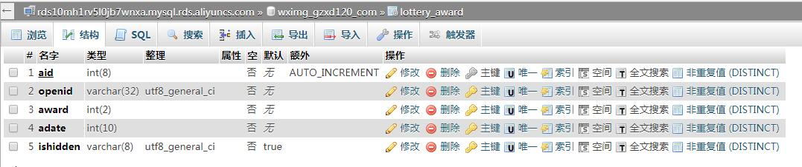
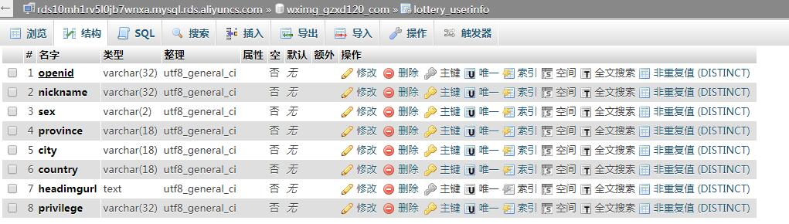
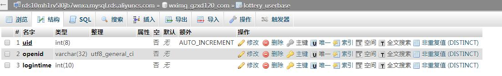

# LotteryBox
HTML抽奖转盘，模拟现实生活的抽奖箱逻辑

# 优势 #
需求：当抽奖人数确定，并且要求所有人抽完奖后，所有的奖品一定要被抽完。不能出现：抽完奖后，所有人抽到的奖品总数多于设定奖品，也不能少设定的奖品。

分析：现实生活的抽奖箱可以解决上述问题，本例就是模拟抽奖箱的逻辑，符合公平公正的原则，并且可以实现所有人抽完奖后必然出现所有奖项。

# 抽奖箱逻辑分析（程序实现） #
1. 把写有奖品的卡片与没写奖品的卡片混合放到抽奖箱中（奖品代号随意放到数组中）
2. 抽奖时每个人从抽奖箱中抽取一张卡片（arrary_and()随机获取数组的一个下标）
3. 抽奖箱的内卡少了一张（uset()抽取到的元素，array_values()重新建立数组索引）
4. 下一个人抽奖（增加并发访问锁，防止两个人同时抽奖对奖池数据的污染）

# 备注 #
./create\_award\_pool.php   用于生成奖池，用于初始化奖池文件

# 涉及内容 #
1. PHP + MySQL
2. HTML5 canvas 绘图技术
3. MySQL多表查询
4. bootstrap前端布局
5. jQuery ajax请求
6. 微信服务号授权登录
7. 微信JS-SDK自定义分享内容
8. 奖品数组转化为json保存到文件
9. 并发访问文件锁
10. 随机获取数组中的元素
11. PHP文件读写操作

# MySQL Table #
1.lottery_award

2.lottery_userinfo

3.lottery_userbase

# DEMO #
