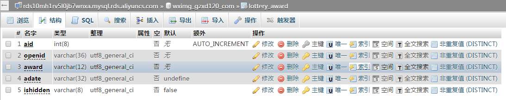
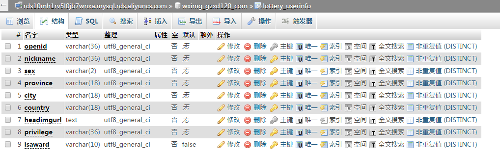

# Lottery
抽奖大转盘

# 介绍 #
主要逻辑：微信授权后通过数组指定奖品，前端通过HTML5 canvas绘制抽奖转盘，并通过数字可以指定显示用户抽到了什么奖。

# 涉及的web技术 #
1. PHP + MySQL
2. HTML5 canvas 绘图技术
3. MySQL联合查询
4. bootstrap前端布局
5. HTML锚点+JS定时刷新页面
6. jQuery ajax请求
7. 微信服务号授权登录接口

# MySQL Table #
1.lottery_award

2.lottery_userinfo

# DEMO #
[http://wximg.gzxdzlyy.com/Lottery/](http://wximg.gzxdzlyy.com/Lottery/ "http://wximg.gzxdzlyy.com/Lottery/")